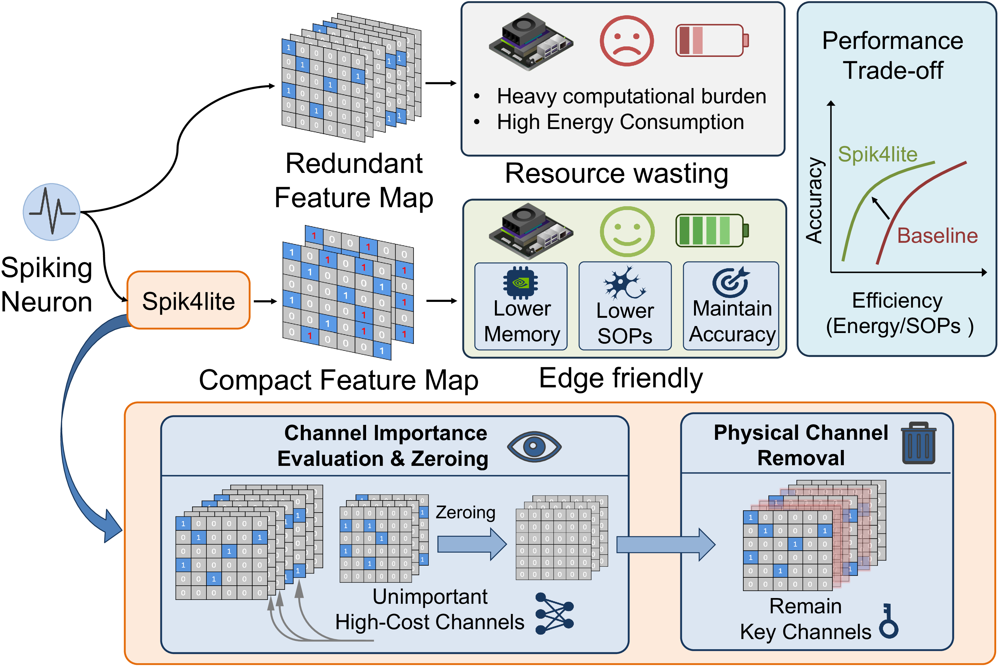
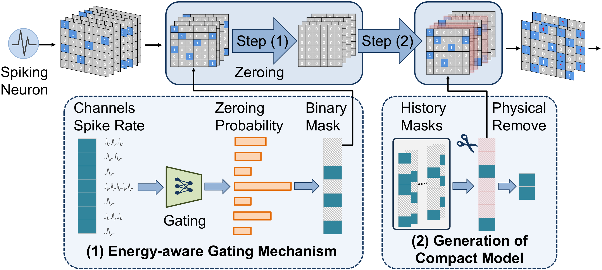

# Spik4lite: Refactoring Neuromorphic Sparsity for Efficient Spiking Neural Networks on Commodity Edge Devices

This repository provides a demo implementation for the paper **"Spik4lite: Refactoring Neuromorphic Sparsity for Efficient Spiking Neural Networks on Commodity Edge Devices"**.

Spik4lite is designed as a lightweight plug-and-play module for improving the accuracy-efficiency trade-off of spiking neural networks (SNNs), especially SNN-Transformer models deployed on commodity edge devices such as NVIDIA Jetson platforms.

---

## Abstract

Recently, the spiking neural networks (SNNs) have shown great promise in enhancing AI task performance by utilizing the brain-inspired and energy-efficient computational paradigm via the binary (0/1) spikes. Modern SNNs, especially those based on transformers, often require FPGA accelerators or neuromorphic chips (e.g., Intel Loihi) to enable spike-driven computations. However, this domain-specific hardware is not always accessible on commodity edge devices like NVIDIA Jetsons, which may degrade SNNs' energy efficiency due to massive computational waste on inactive "0" spikes and finally undermine the usage boundary. This limitation raises an interesting question: is it possible to make SNNs edge-friendly and tame the computations mostly on active "1" spikes? In this paper, we present the answer yes and propose Spik4lite, which serves as a lightweight plug-and-play module to significantly improve SNN's performance between model accuracy and computational efficiency. The key is to refactor SNN's channel-wise neuromorphic sparsity by zeroing out low-efficiency channels while proactively compensating for the eliminated spikes. Different from prior methods mainly focusing on optimizing the theoretical synaptic operations, our design philosophy can evolve the SNNs into a physically compact manner, thus inherently saving more computational and energy costs. Extensive experiments based on real edge devices show that Spik4lite can be integrated into existing SNN baselines to further improve their accuracy-and-efficiency performance, guaranteeing the model accuracy while saving the computational and energy costs.

## Framework

The core pipeline of Spik4lite contains three stages:

1. Train an SNN baseline with learnable energy-aware gates.
2. Accumulate channel statistics and determine the retained channels.
3. Prune the network into a physically compact model for efficient inference.

The following figures provide an overview of the Spik4lite pipeline and module design.

<p align="center">
  
</p>

<p align="center">
  <em>Overview of the Spik4lite compression pipeline.</em>
</p>

<p align="center">
  
</p>

<p align="center">
  <em>Detailed design of the Spik4lite module.</em>
</p>

## Getting Started

### 1. Installation

Clone this repository and enter the project directory:

```bash
git clone <your-repository-url>
cd Spik4lite
```

Create the Conda environment from the provided environment file:

```bash
conda env create -f environment.yml
conda activate Spik4lite
```

Main tested dependencies:

- Anaconda
- Python 3.12.2 on GPU server / Python 3.10 on Jetson
- PyTorch 2.5.0
- CUDA 12.4
- SpikingJelly 0.0.0.0.14
- JetPack 6.2.0 (L4T 36.4.3) for Jetson experiments

### 2. Dataset Preparation

The demo covers the following datasets:

- CIFAR-10
- CIFAR-100
- CIFAR10-DVS
- DVS128 Gesture

Please download the datasets and update the corresponding dataset paths or configuration files in each model directory before running experiments. Each baseline folder contains its own README and dataset-specific training scripts.

## Running Experiments

Each baseline directory is self-contained. Enter the model directory first, activate the Conda environment, then run the dataset-specific training script.

### Spikingformer + Spik4lite

```bash
cd Spikingformer
conda activate Spik4lite

cd cifar10
python train.py
```

Other available tasks are located in:

- `Spikingformer/cifar100`
- `Spikingformer/cifar10-dvs`
- `Spikingformer/dvs128-gesture`

### Spikformer + Spik4lite

```bash
cd spikformer
conda activate Spik4lite

cd cifar10
python train.py
```

Other available tasks are located in:

- `spikformer/cifar100`
- `spikformer/cifar10dvs`
- `spikformer/dvs128gesture`

### Spike-Driven Transformer + Spik4lite

```bash
cd Spike-Driven-Transformer
conda activate Spik4lite

python cifar10/train.py
```

Other available tasks are located in:

- `Spike-Driven-Transformer/cifar100`
- `Spike-Driven-Transformer/cifar10-dvs`
- `Spike-Driven-Transformer/dvs-gesture`

### Energy and SOPs Evaluation

Some experiment folders include scripts for SOPs or energy-consumption analysis, for example:

```bash
python SOPs_consumption_on_cifar10.py
```

Please run these scripts from the corresponding dataset directory, following the dedicated README inside each baseline folder.

## Project Structure

```text
Spik4lite/
|-- Spik4lite.py                  # Core Spik4lite layers, gating, and pruning utilities.
|-- environment.yml               # Conda environment used by the demo.
|-- pic/
|   |-- overview.png              # Overview figure of the compression pipeline.
|   `-- model.png                 # Detailed figure of the Spik4lite module.
|-- Spikingformer/                # Spikingformer baseline with Spik4lite demos.
|   |-- cifar10/
|   |-- cifar100/
|   |-- cifar10-dvs/
|   `-- dvs128-gesture/
|-- spikformer/                   # Spikformer baseline with Spik4lite demos.
|   |-- cifar10/
|   |-- cifar100/
|   |-- cifar10dvs/
|   `-- dvs128gesture/
`-- Spike-Driven-Transformer/     # Spike-Driven Transformer baseline with Spik4lite demos.
    |-- cifar10/
    |-- cifar100/
    |-- cifar10-dvs/
    `-- dvs-gesture/
```

## Notes

- The root README provides the overall project entry point.
- For exact hyperparameters, dataset paths, and dataset-specific commands, please refer to the README and configuration files inside each baseline directory.
- Power profiles and SOPs scripts are included for selected experiments to support edge-device efficiency analysis.

## Acknowledgement

This demo builds on representative SNN-Transformer baselines, including Spikformer, Spike-Driven Transformer, and Spikingformer. We thank the original authors for releasing their implementations.
